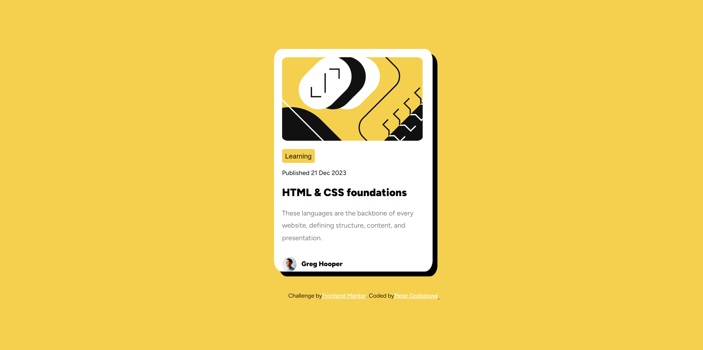

# Blog Preview Card

This project is a simple blog preview card designed and coded as a Frontend Mentor challenge. It showcases a blog post with a title, publication date, content snippet, author's name, and an avatar.

## Technologies Used
- HTML
- CSS

## Project Structure
- index.html: Contains the HTML markup for the blog preview card.
- style.css: Includes the CSS styling for the blog preview card.
- assets/: Directory containing images used in the project.

## Usage
1. Clone the repository to your local machine:
2. Open index.html in your web browser to view the blog preview card.

## Screenshots
### Desktop (1440px)

### Mobile (375px)

## Credits
- Design Challenge: [Frontend Mentor](https://www.frontendmentor.io/challenges/blog-preview-card-component-PH92eAR2-)
- Coded by: [Peter Godspower](https://github.com/Theviod616)